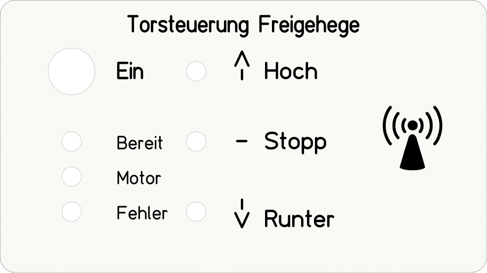
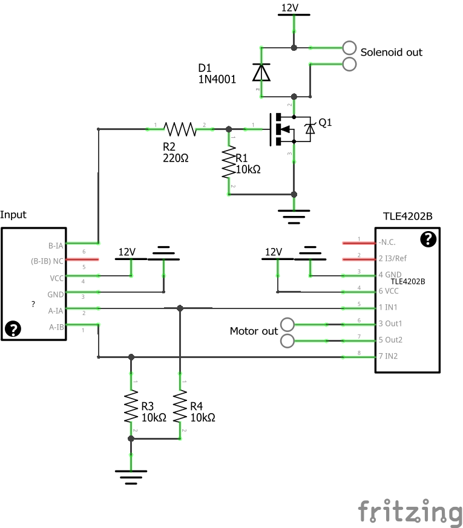

# Arduino electric chicken stall door
Diy motorized door for a chicken stall, controlled by Arduino Nano

# Features
- motor can be controlled with
  - buttons on the main controller box
  - 433 Mhz remote
  - UART (RX/TX) communication (can be used with a PC or with a ESP8266 to make the system controllable over Wifi)
- two Reed-switches to indicate top and bottom position of the door
- safety end-stop-switch to cut off the power if the door in case of failure does not stop in its top position
- Solenoid lock to lock the door
- leds to indicate error/ready state

# Hardware

## Parts-List
- Motor with gear-system to create some holding torque in the top position (and stop the door from going down again by itself).
  I used one with 20 rpm and a torque of 0,15Nm ([link](https://www.pollin.de/p/gleichstrom-getriebemotor-pgm-37dc12-21-310482))
- HG7881 motor driver board, I used this one ([link](https://www.pollin.de/p/motorantriebsmodul-daypower-motor-9110-810572))
  
  OR: A [TLE4202B](https://www.pollin.de/p/tle4202b-sts-b57928-101044) and a N-Channel Mosfet to create your own motor- and solenoid-driver board (see below)
- 2x Some kind of door reed contact ([link](https://www.pollin.de/p/tuerkontakt-fensterkontakt-mit-25-cm-anschlusslitzen-10-w-braun-580569))
- 433 Mhz receiver ([link](https://www.amazon.de/iHaosapce-Wireless-Transmitter-Receiver-Raspberry/dp/B07B9KV8D9/ref=sr_1_5?__mk_de_DE=%C3%85M%C3%85%C5%BD%C3%95%C3%91&crid=QDNC0EBPSCZW&keywords=receiver+433+mhz&qid=1662887769&sprefix=receiver+433+mh%2Caps%2C147&sr=8-5))

- Solenoid Lock ([link](https://www.ebay.de/itm/273873875970), 12V/350mA version)
- Some leds, resistors, screw terminals, ...

## Schematic

## PCB Layout

## Front panel for the main controller
The size of this frontpanel is 125x70mm. You can customize it using the free ["Frontplatten Designer"](https://www.schaeffer-ag.de/frontplatten-designer).

# Motor Driver
You can either use a premade motor driver like the one I linked in the parts list or build your own. The pins on the main pcb for this driver stay the same.
This driver is based on the TLE4202B. Since the solenoid lock doesn’t need a in the polarity switchable voltage, we can use a simple Mosfet to control it.

This circuit is not perfect, since it does not feature any filter-capacitors, which are recommended in the datasheet. But it works for the most parts :).

# 3D-printed parts
## Winch drum for the motor
I created a 3D-model for a winch drum, to which rope of the door the can be spooled to. It fits to the flattened motor axis. A M3 screw can be screwed in the second hole to tighten the motor axis. The rope can also be tightened to this screw (if the screw is long enough). This part fits to the motor linked in the parts list and I think it will also fit to any other motor with 6mm axis.
You can customize the model using tinkercad and [this link](https://www.tinkercad.com/things/7C84V8nsqCm).
### [3D-Model](Motor_Winch_Drum.stl)

## Mount for the solenoid lock
This part is used to hold the solenoid lock. It will fit to the solenoid linked in the parts list. For other solenoids please check the dimensions. You can customize the model using tinkercad and [this link](https://www.tinkercad.com/things/a6mTNkn8J4k).
### [3D-Model](Solenoid_Lock_Mount.stl)

# Software
In the code I am using the RCSwitch-library. Since it is already included in the code-folder there is no need to download an import it manually. I have linked it in the code anyway.

To get your 433Mhz remote working with the controller fist upload the `ReceiveDemo_Simple.ino`-sketch from the RCSwitch-Library examples. Now open the serial monitor an then press the keys on your remote, that you want to use. Now copy the received codes from the serial monitor into the `Remote Codes`-Section in the code.

You need to test out how long your opening/closing process of the door takes with your motor. If you have measured it add a few seconds to the value an change the `motor_timeout`-variable in the code to this value in **milliseconds** (10s = 10000ms). If the motor is running longer than this timeout it stops automatically.

## Serial Communication
I implemented a serial interface to control the movement. If you add a Wifi-capable microcontroller (like the ESP8266) to this interface, it can make the system remote-controllable over wifi.

The functionality of the UART interface:
- Baudrate: **9600**
Commands:
- Request State of the Door: 'S'
  - Returns: 1 - Door is open, 0 - Door is closed, 2 - Unknown Position
- Open Door: 'U'
  - Returns: 'U'
  - If it fails or not possible (already open): 'E'
- Open Door: 'D'
  - Returns: 'D'
  - If it fails or not possible (already closed): 'E'
- Stop Movement: 'H'
  - Returns: 'H'

# References/Sources
- RC Switch Lib: https://github.com/sui77/rc-switch
- CCC - Chicken-Coop-Control: https://sites.google.com/view/arduino-chicken-coop-control/home
- https://funduino.de/nr-03-433mhz-funkverbindung

 

This work by Dustin Brunner is licensed under <a rel="license" href="https://creativecommons.org/licenses/by/4.0">CC BY 4.0</a>

 Dieses Werk von Dustin Brunner ist lizenziert unter einer <a rel="license" href="http://creativecommons.org/licenses/by/4.0/">Creative Commons Namensnennung 4.0 International Lizenz</a>.

